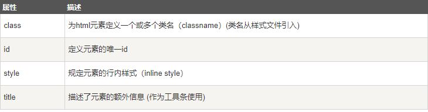
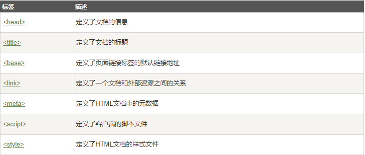
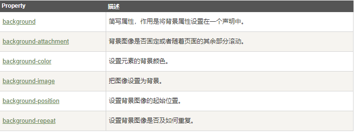

# Web-JavaScript
学习JavaScript的笔记

目录
-----

   * [复习](#fu-xi)
       * [HTML](#html)
       * [CSS](#css)
       * [一些英文](#some-english)
   * [附录](#fu-lu)


## 复习

### HTML

* **HTML快速复习**

*[**HTML快速复习教程**](http://www.runoob.com/html/html-quicklist.html)*

* **HTML5声明**

```HTML
<!DOCTYPE html>
```

* **h1->h6字体由大变小**

* **HTML链接**

```HTML
<a href="http://www.github.com/leesoar">这是一个链接</a>
```

*[**ID属性实例**](http://www.runoob.com/try/try.php?filename=tryhtml_link_locations&basepath=0)*

* **HTML图像**

```HTML

```

* **HTML元素属性**



* **HTML注释**

```HTML
<!-- 这是一个注释 -->
```

* **HTML文本格式化**

*点此查看：[**文本格式化实例**](http://www.runoob.com/html/html-formatting.html)*

* **HTML head元素**



* **HTML:CSS内联样式**

```HTML
<p style="color:blue;margin-left:20px;">This is a paragraph.</p>
```

*附：[**CSS基本概念复习**](http://www.runoob.com/html/html-css.html)*

* **表格的thead、tbody、tfoot详解**

	thead ---------定义表格的页眉
	
	tbody ---------定义表格的主体
	
	tfoot ---------定义表格的页脚


* **HTML列表**

*详解：[**列表**](http://www.runoob.com/html/html-lists.html)*

* **HTML表单和输入**

*详解：[**表单和输入**](http://www.runoob.com/html/html-forms.html)*

* **HTML框架**

*详解：[**iframe框架**](http://www.runoob.com/html/html-iframes.html)*


### CSS

* **CSS背景属性**



### 一些英文

* cellpadding:单元格边距

* cellspacing:单元格间距

* border:边界(常用于表格)

* col:即column，列

* align:排成一列(作用为水平对齐)

* span: 跨越(常用于colspan与rowspan，即合并单元格)

* margin: 边缘、边距(常用于设置所有外边距属性)

* caption: 标题、说明(常用于表格标题)

* div:即division,区、区域、部分、界限(div元素是块级元素，它可用于组合其他 HTML 元素的容器)

* option:选择(常用于下拉框选项中)


## 附录

* *[**HTML支持的颜色名**](http://www.runoob.com/html/html-colornames.html)*

* *[**HTML字符实体**](http://www.runoob.com/html/html-entities.html)*